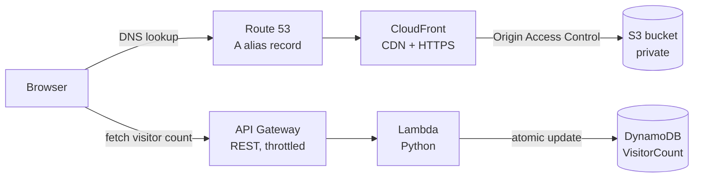

# Cloud Resume Challenge

My resume, hosted as a serverless website on AWS, with a live visitor counter.

**Live site:** [delhoyo.dev](https://delhoyo.dev)

Built by **Mauricio del Hoyo**, Cloud Technical Consultant at Siemens DISW, Mexico City.

---

## Architecture

The site runs on two parallel flows: one serves the static page, and one powers the visitor counter.



**Page load:** Browser → Route 53 → CloudFront → S3 (private bucket)

**Visitor counter:** Page JavaScript → API Gateway → Lambda → DynamoDB

### AWS services

| Service | Role |
|---|---|
| **S3** | Stores the static site files. The bucket is private, and static website hosting is turned off. |
| **CloudFront** | CDN with HTTPS. Reads from S3 through Origin Access Control (OAC). Default root object is `index.html`. |
| **Route 53** | Domain registration and DNS. An A alias record points to CloudFront. |
| **API Gateway** | REST API in front of the Lambda function, with stage-level throttling. |
| **Lambda** | Python function that increments and returns the visitor count. |
| **DynamoDB** | Stores the visitor count and last-visit timestamp. |
| **CloudWatch** | Logs for Lambda and API Gateway. |

---

## Security and cost controls

- **Private S3 bucket.** Block Public Access is on. A bucket policy restricts reads to this CloudFront distribution only, using a `StringEquals` condition on the distribution ARN.
- **HTTPS everywhere** through CloudFront.
- **CORS restricted** to `https://delhoyo.dev`, not `*`.
- **Rate limiting** on API Gateway: 10 requests/second, burst of 20. There's intentionally no API key, because any key would be visible in the browser's JavaScript.
- **Atomic counter updates.** DynamoDB `update_item` with `ADD` prevents race conditions between simultaneous visitors.
- **Logging.** CloudWatch logs for Lambda and API Gateway. CloudFront access logs go to a dedicated S3 bucket.
- **Cost guardrail.** An AWS Budget alerts at $10/month, managed from the AWS Organizations management account and scoped to the project's member account.

---

## Repository structure

```
.
├── src/
│   ├── frontend/
│   │   ├── index.html                 # Resume page
│   │   └── main.css                   # Styles
|   |   └── fetchAPI.js                # Calls the API and updates the counter
│   └── backend/
│       ├── incrementVisitorCount.py   # Lambda handler
└── README.md
```

---

## How the visitor counter works

1. `index.html` loads `fetchAPI.js`.
2. `fetchAPI.js` calls the API Gateway endpoint.
3. API Gateway invokes the Lambda function `incrementVisitorCount.py`.
4. Lambda atomically increments `visitor_count` in DynamoDB, updates `last_visit`, and returns both as JSON.
5. The script parses the response and writes the count into the `#visitor-count` element in the page footer.

---

## Deployment

Deployment is currently manual:

1. Upload the frontend files to the S3 bucket.
2. Create a CloudFront invalidation so the new files are served.

Automating this is on the roadmap below.

---

## Roadmap

- [ ] **CloudFront custom error pages.** Return `index.html` for 403/404 instead of raw XML.
- [ ] **Infrastructure as Code.** Define all AWS resources in CloudFormation or Terraform.
- [ ] **CI/CD with GitHub Actions.** Sync to S3 and invalidate CloudFront on every push to `main`, then extend the pipeline to run IaC.
- [ ] **CloudWatch alarms.** Alert on Lambda errors and API Gateway 5xx spikes via SNS email.
- [ ] **IAM least privilege.** Limit the Lambda role to `dynamodb:GetItem` and `dynamodb:UpdateItem` on the table ARN only.
- [ ] **Cache busting.** Version CSS/JS references so deploys don't need manual invalidations.
- [ ] **VPC networking exercise.** EC2 in a VPC with public and private subnets, a NAT gateway and security groups.

---

## Lessons learned

- **Turning off S3 website hosting requires a CloudFront default root object.** Without it, requests to `/` fail.
- **API Gateway wraps the Lambda response.** The frontend has to `JSON.parse(data.body)` to read the count, otherwise it shows `undefined`.
- **Template literals need backticks.** `` `${count}` `` works, but `'${count}'` prints the text literally.
- **Turn on domain auto-renew.** My original domain expired and was taken by a domain squatter. Moving to `delhoyo.dev` meant a new ACM certificate, new CloudFront alternate domain names, a recreated Route 53 hosted zone and an updated CORS header. The new domain has auto-renew turned on.
- **Throttling has more than one layer.** Under load testing, Lambda's concurrency burst limit was reached before API Gateway's rate limit, which caused 500 errors. This isn't a concern at real traffic levels, but it showed that each service enforces its own limits.

---

## About the Cloud Resume Challenge

The [Cloud Resume Challenge](https://cloudresumechallenge.dev/) is a hands-on project created by Forrest Brazeal that covers static hosting, DNS, serverless APIs, databases, IaC and CI/CD.
